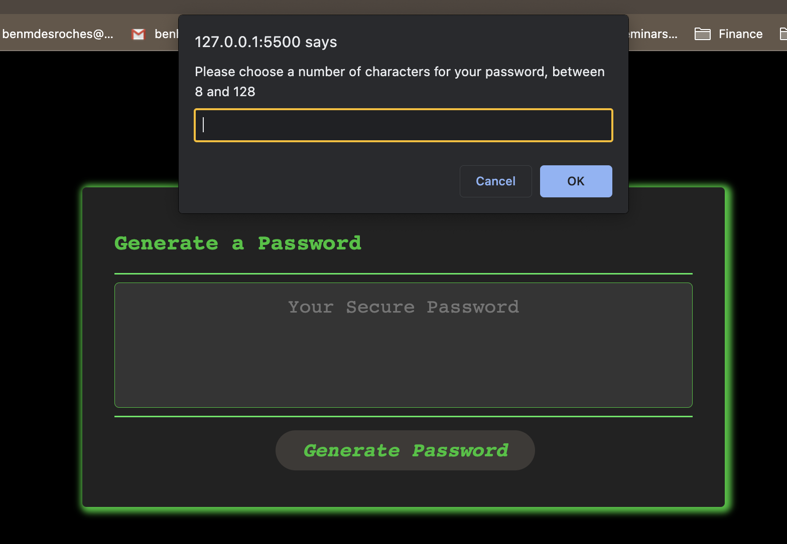
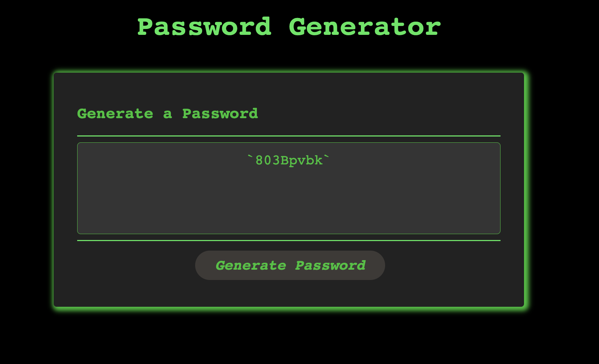

# Huzzah-PasswordGenerator

## Description

This projects is part of a Full Stack Coding Bootcamp (see credits) challenge which asks that one use Javascript to modify the provided code and create a password generator that creates a random password according to the users choices. Here is the User Story provided:

## User Story

```text
AS AN employee with access to sensitive data
I WANT to randomly generate a password that meets certain criteria
SO THAT I can create a strong password that provides greater security
```

## Acceptance Criteria

```text
GIVEN I need a new, secure password
WHEN I click the button to generate a password
THEN I am presented with a series of prompts for password criteria
WHEN prompted for password criteria
THEN I select which criteria to include in the password
WHEN prompted for the length of the password
THEN I choose a length of at least 8 characters and no more than 128 characters
WHEN asked for character types to include in the password
THEN I confirm whether or not to include lowercase, uppercase, numeric, and/or special characters
WHEN I answer each prompt
THEN my input should be validated and at least one character type should be selected
WHEN all prompts are answered
THEN a password is generated that matches the selected criteria
WHEN the password is generated
THEN the password is either displayed in an alert or written to the page
```

## Usage

To use the application, the user must make their way to the page and click on the "Generate Password" Button.


 The button will generate prompts where the user must choose the length of the password and which characters will be used (lowercase, uppercase, numeric, and/or special), according to certain parameters. The application will then provide a password fitting these criteria in the text box.
For specific parameters necessary, see Acceptance Criteria.




For access to the deployed website: <https://benhwaet.github.io/Huzzah-Password.Generator/> .

## Credits

The starter code provided includes the index.html, style.css, script.js (lines 1 to 14), and the Challenge03README.md files. These were provided by edX (<www.edx.org>) who created the materials and instruction for the bootcamp mentioned in the description. This bootcamp is hosted by the University of New Brunswick (<https://bootcamps.unb.ca>).

I used the for loop from a tutorial on foolishdeveloper.com, changing the variables to fit my code. (See javascript comments for full link.)

## License

This project uses the MIT License. For more details, see the LICENSE file in the repository for this project.
